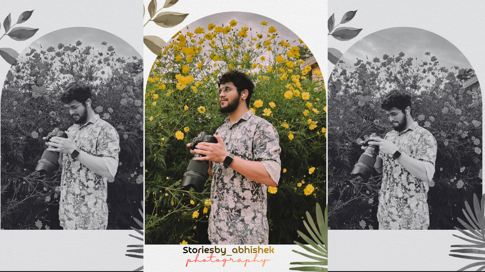

# 📸 Photographer Portfolio Website

<div align="center">

  

  ### A Premium, Immersive Digital Experience for Visual Storytellers

  <p align="center">
    <a href="https://pallavijadar.github.io/Photo-Polio/">
      
    </a>
  </p>

  <p align="center">
    
    
    
    
  </p>

</div>

---

## ✨ Overview

Welcome to the **Photo-Polio** repository! This is a high-end, fully responsive portfolio website designed for professional photographers. It features a dark, cinematic aesthetic with gold accents, smooth animations, and an immersive user experience.

## 🚀 Key Features

*   **💎 Premium Aesthetic**: A sophisticated Black & Gold theme using 'Nanum Myeongjo' and 'Lavishly Yours' typography.
*   **📱 Fully Responsive**: Flawless display on all devices, from desktop monitors to mobile phones.
*   **✨ Interactive Elements**:
    *   **Glassmorphism** navigation bar.
    *   **Hover Effects** on images, buttons, and text.
    *   **Animated Icons** that rotate and glow.
*   **🖼️ Dynamic Gallery**: Masonry-style grids for portfolio and Instagram showcases.
*   **🔗 Social Integration**: "For More" section with interactive links to Instagram and YouTube.

## 🛠️ Tech Stack

*   **Frontend**: HTML5, CSS3 (Custom Properties, Flexbox, Grid)
*   **Icons**: Font Awesome 6
*   **Fonts**: Google Fonts (Poppins, Nanum Myeongjo, Lavishly Yours, Caveat)
*   **Hosting**: GitHub Pages

## 📂 Project Structure

```bash
├── css/
│   └── style.css       # Main stylesheet with responsive media queries
├── images/             # Optimized assets for gallery and layout
├── index.html          # Semantic HTML5 markup
└── README.md           # Project documentation
```

## 🌐 Live Demo

Check out the live website here:
👉 **[https://pallavijadar.github.io/Photo-Polio/](https://pallavijadar.github.io/Photo-Polio/)**

## 👨‍💻 Developed By

**DevXign**
*Creating immersive digital experiences.*

---

<div align="center">
  <sub>Built with ❤️ by Pallavi Jadar</sub>
</div>
